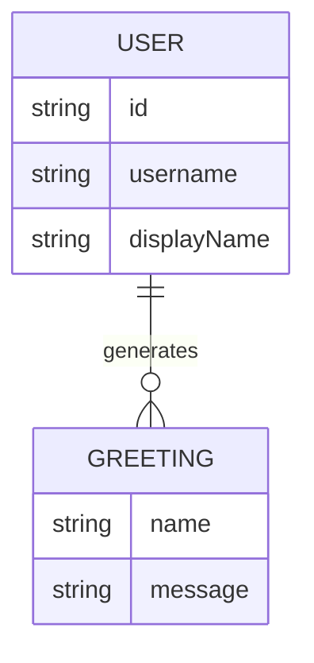

# Domain model

The app's only data is the signed-in user (from Thunder) and the greeting they generate — the greeting is never persisted, it exists only on screen until the next one is generated.

- `USER` comes from the sign-in identity (Thunder); the app stores no user record of its own.
- `GREETING` is computed in the browser from the name the user typed and is never saved.