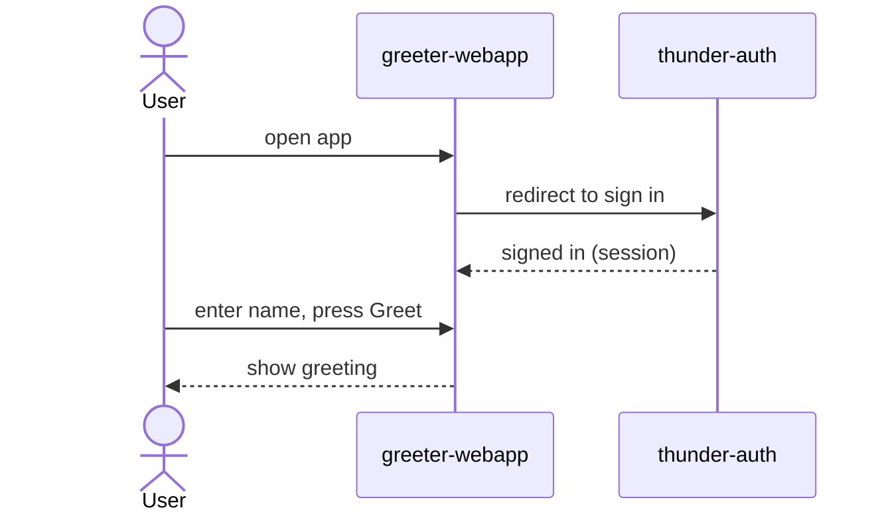

# Sign in and greet

A User signs in through Thunder, then types a name and gets a greeting shown on the same screen.

```mermaid
sequenceDiagram
    actor User
    participant greeter-webapp
    participant thunder-auth

    User->>greeter-webapp: open app
    greeter-webapp->>thunder-auth: redirect to sign in
    thunder-auth-->>greeter-webapp: signed in (session)
    User->>greeter-webapp: enter name, press Greet
    greeter-webapp-->>User: show greeting
```